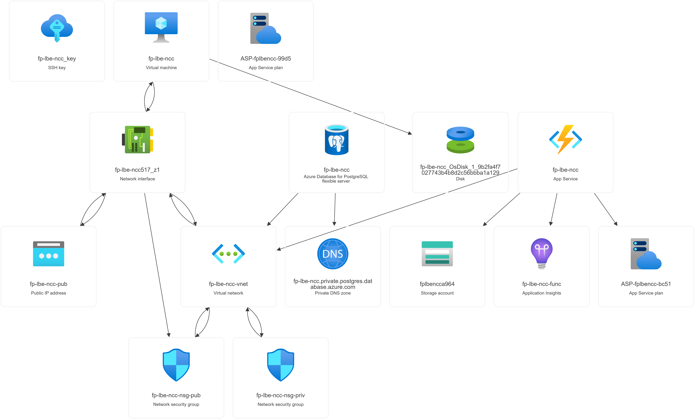
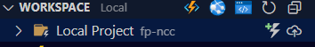

# Final Project LBE NCC 2025

## Tujuan

Membangun aplikasi sederhana berbasis cloud menggunakan beberapa layanan utama Azure, yang mencakup: **Virtual Machine**, **Blob Storage**, **Azure Functions**, dan **Azure Database for PostgreSQL Flexible Server**.

---

## Arsitektur

Aplikasi ini akan memiliki arsitektur sebagai berikut:

- **Frontend**: Dijalankan pada sebuah **Azure Virtual Machine (VM)**.
- **File Statis**: Disimpan dalam **Azure Blob Storage** (misalnya, gambar, dokumen).
- **Database**: Menggunakan **Azure Database for PostgreSQL Flexible Server** untuk menyimpan data aplikasi.
- **Backend API**: Dijalankan oleh **Azure Functions** sebagai layanan _serverless_.



---

## Contoh Hasil Jadi

Jika kalian ingin melihat contoh aplikasi yang sudah selesai, kalian dapat mengaksesnya melalui tautan berikut:

`http://fp-lbe-ncc.indonesiacentral.cloudapp.azure.com/`

---

## Langkah-langkah Implementasi

### 1. Deploy Frontend di Virtual Machine

Langkah pertama adalah menyiapkan dan mengkonfigurasi server web untuk frontend.

- **Buat Resource Group**: Buat resource group baru di Azure Portal untuk menampung semua resource proyek ini.
- **Deploy Virtual Machine**:
  - Buat VM baru dengan sistem operasi **Linux (Ubuntu)**.
  - Saat konfigurasi, pastikan untuk membuka port **22 (SSH)**, **80 (HTTP)**, dan **443 (HTTPS)** pada Network Security Group (NSG).
- **Konfigurasi Server**:
  - Hubungkan ke VM menggunakan SSH.
  - Install Nginx dan PostgreSQL client dengan perintah:
    ```bash
    sudo apt update
    sudo apt install nginx postgresql-client -y
    ```
  - Clone repository frontend:
    ```bash
    git clone --branch frontend https://github.com/hamasfaa/crud-lbe-ncc-2025
    ```
    > Ganti `[nama-folder]` dengan nama direktori pilihan kalian.
- **Konfigurasi Nginx**:

  - Buat file konfigurasi baru di `/etc/nginx/sites-available/default`:

    ```nginx
    server {
        listen 80;
        server_name _;

        root /var/www/[nama-folder];
        index index.html;

        location / {
            try_files $uri $uri/ =404;
        }
    }
    ```

  - Aktifkan dan restart Nginx untuk menerapkan perubahan.

- **Update Konfigurasi Frontend**:
  - Edit file `env.js` di dalam folder frontend.
  - Sesuaikan URL API agar mengarah ke URL Azure Functions yang akan kalian buat nanti.

### 2. Deploy Database PostgreSQL

Selanjutnya, siapkan database untuk menyimpan data aplikasi.

- **Deploy PostgreSQL Flexible Server**:
  - Buat resource **Azure Database for PostgreSQL Flexible Server**.
  - Pilih opsi **VNet Integration** saat pembuatan untuk memastikan koneksi yang aman dengan VM dan Azure Functions.
- **Buat Database dan Tabel**:
  - Setelah server berhasil dibuat, hubungkan ke database.
  - Buat database baru.
  - Buat tabel dengan struktur berikut:
    | Kolom | Tipe Data | Keterangan |
    |---------|-------------|------------------------|
    | id | SERIAL | Primary key|
    | nama | VARCHAR(100)| NON NULL |
    | foto_url| VARCHAR(500)| NULLABLE |

### 3. Deploy Backend dengan Azure Functions

Backend akan di-deploy sebagai fungsi _serverless_ untuk menangani logika bisnis.

- **Clone Repository**:
  ```bash
  git clone --branch backend https://github.com/hamasfaa/crud-lbe-ncc-2025
  ```
- **Lengkapi Kode**: Buka proyek backend dan lengkapi bagian yang ditkaliani dengan `// TODO`.
- **Deployment ke Azure Functions**:
  - Deploy proyek backend kalian ke Azure Functions.
  - Tambahkan _environment variables_ berikut pada pengaturan aplikasi Functions:
    - `DB_HOST`
    - `DB_USER`
    - `DB_PASSWORD`
    - `DB_NAME`
    - `DB_PORT`
    - `AZURE_STORAGE_CONNECTION_STRING`
    - `BLOB_CONTAINER_NAME`

#### Pengembangan Lokal (Opsional)

Jika ingin menguji backend secara lokal sebelum deploy:

- Pastikan kalian telah menginstal **Azure Functions Core Tools v4**.
- Salin `local.settings.example.json` menjadi `local.settings.json` dan sesuaikan nilainya.
- Jalankan fungsi secara lokal dengan perintah `func start` atau gunakan fitur **Run and Debug** pada VSCode. Aplikasi akan berjalan di `http://localhost:7071`.

#### Cara Deploy Azure Funtions

- **Prasyarat**: Pastikan kalian telah menginstal ekstensi **Azure Tools** (yang mencakup Azure Functions) di VSCode dan sudah login ke akun Azure kalian.
- **Proses Deploy**:

  1.  Buka folder proyek backend di VSCode.
  2.  Buka panel **Azure** dari Activity Bar.
  3.  Pada bagian bawah terdapat section **WORKSPACE**.
  4.  Tekan ikon **Deploy** (panah ke atas) di sebelah kanan header **Local Project**.

      

  5.  Pilih Function App yang sudah kalian buat di Azure Portal.
  6.  Tunggu hingga proses deployment selesai.

### 4. Konfigurasi Blob Storage

Terakhir, siapkan container untuk menyimpan file yang diunggah.

- **Gunakan Storage Account**: Saat membuat Azure Functions, sebuah Azure Storage Account biasanya akan dibuat secara otomatis. kalian dapat menggunakan Storage Account ini.
- **Buat Blob Container**:
  - Buka resource Storage Account di Azure Portal.
  - Navigasi ke menu **Containers**.
  - Buat sebuah container baru untuk menyimpan file upload dari aplikasi (misalnya, `user-photos`).
  - Pastikan nama container ini sesuai dengan nilai environment variable `BLOB_CONTAINER_NAME` di Azure Functions kalian.
